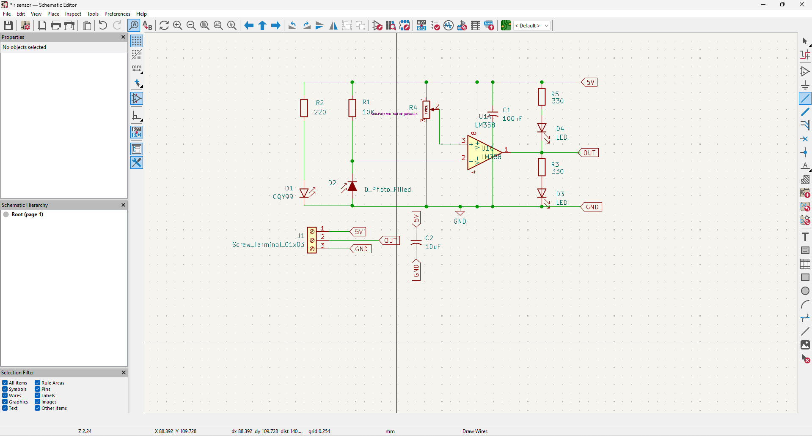
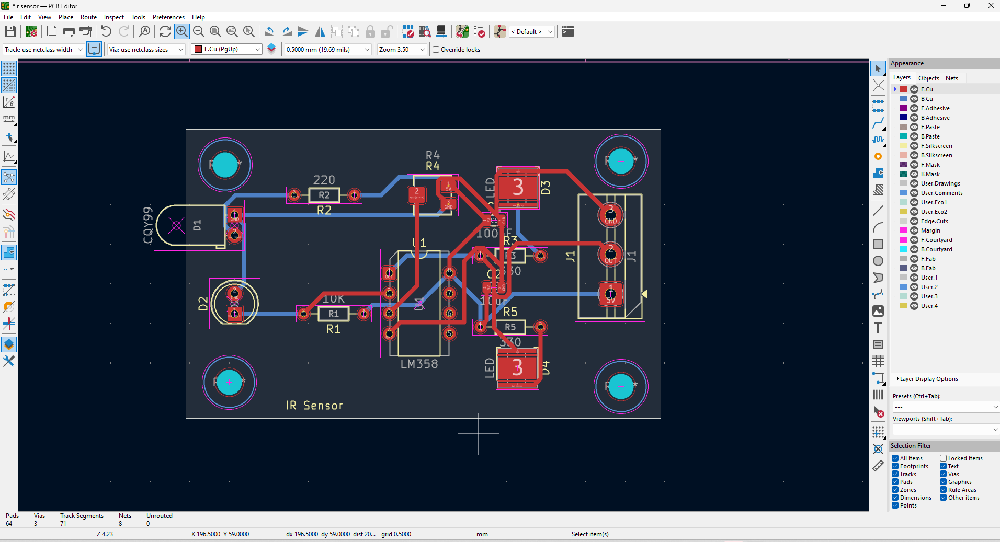
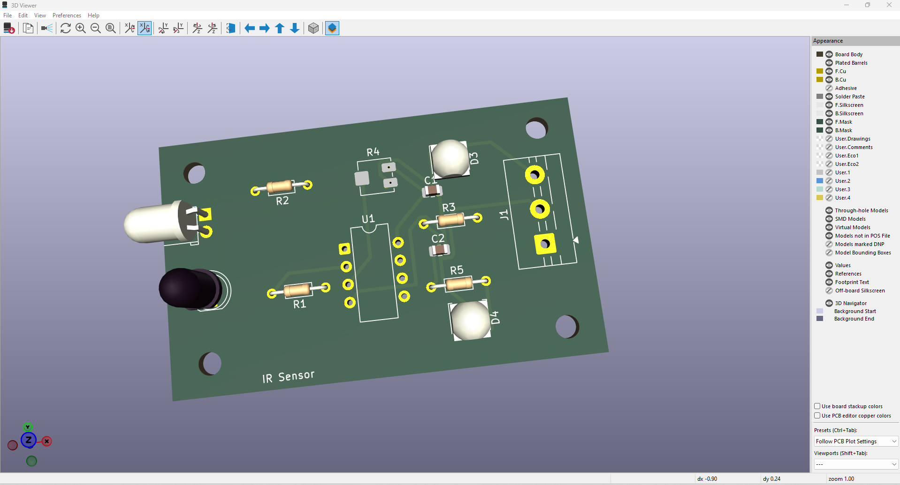

# IR Obstacle Detection Sensor PCB

A custom-designed IR obstacle detection sensor PCB developed using KiCad and LM358 operational amplifier for robotics, automation, and STEM applications.

# IR Obstacle Detection Sensor PCB

## Overview

This project is a custom IR Obstacle Detection Sensor PCB designed using KiCad.

## Features

- LM358 based design
- IR LED transmitter
- Photodiode receiver
- 100nF and 10uF filtering capacitors
- Compact PCB layout

## Applications

- Obstacle Detection Robots
- Line Following Robots
- Automation Systems
- STEM Learning Projects

## Circuit Operation

The IR LED continuously emits infrared light.

When an object comes close to the sensor, the emitted infrared light reflects back and is detected by the photodiode.

The LM358 operational amplifier processes this signal and produces an output indicating the presence of an object.

## Schematic

## PCB Layout

## 3D View

## Software Used

- KiCad 9

## Author

Agilan Loganathan
